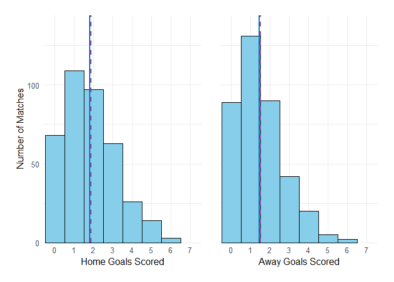
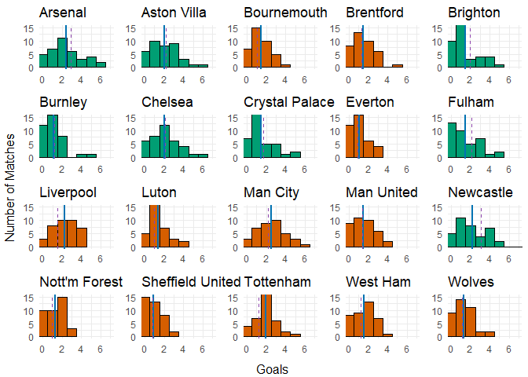
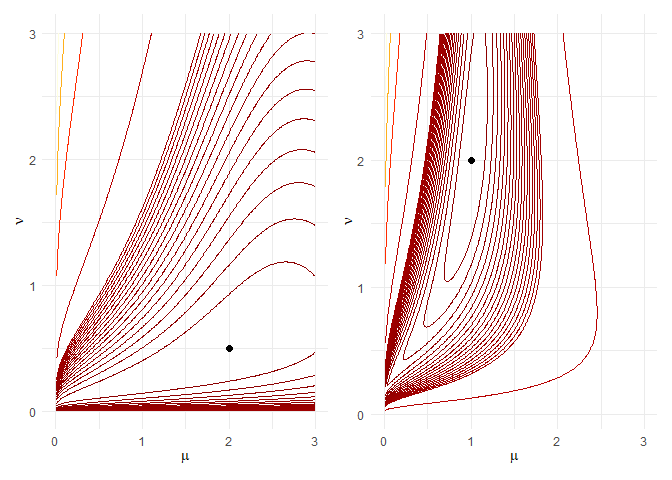
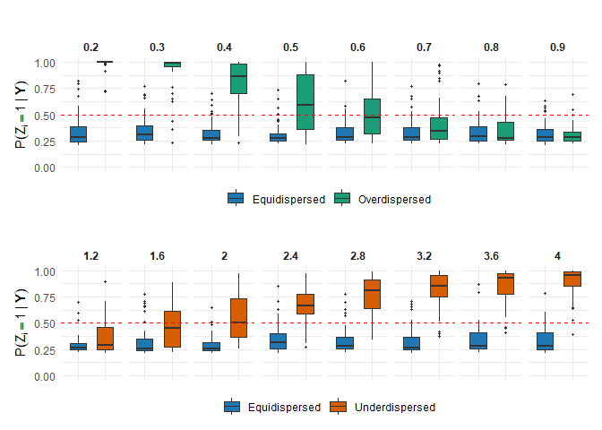
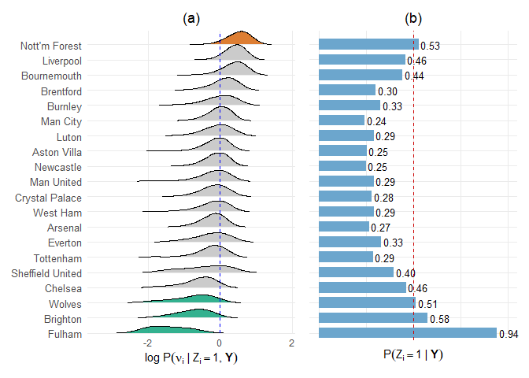
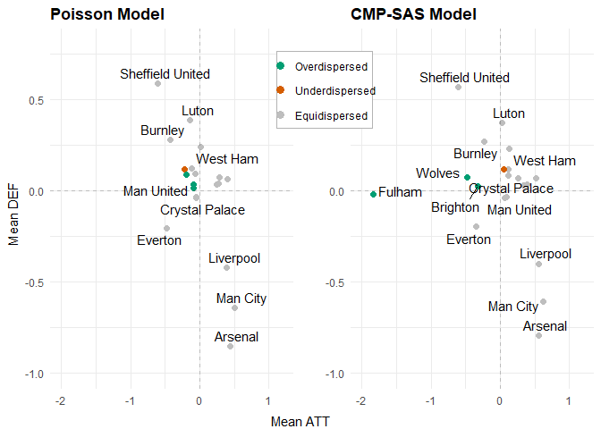
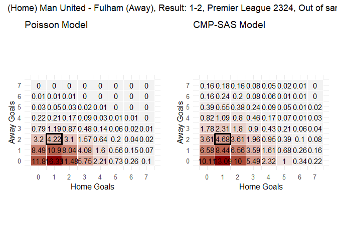

# Figures and Tables - Notebook


## Notebook

This notebook reproduces all figures and tables in the paper

#### Preliminary

``` r
source('utils.R') # Contains all utility functions to support modelling and analysis, including functions to import/export data, manipulate the MH_posterior objects from the MCMC routines, and generate predictions
library(patchwork)
library(ggrepel)
library(ggplot2)
library(gridExtra)
library(grid)
library(cowplot)
library(ggridges)
library(forcats)
library(kableExtra)
mcmc_out_dir = "Data/MCMC_Outputs/"
```

##### Figure 1

``` r
X = read_data('2324', 'Premier')
X1 = X[[1]]
X2 = X[[2]]

# Remove diagonals
X1_nodiag = X1[upper.tri(X1) | lower.tri(X1)]
X2_nodiag = X2[upper.tri(X2) | lower.tri(X2)]

# Truncate values > 7
X1_nodiag = X1_nodiag[X1_nodiag <= 7]
X2_nodiag = X2_nodiag[X2_nodiag <= 7]

# Convert to factors for exact bins 0 to 7
X1_factor = factor(X1_nodiag, levels = 0:7)
X2_factor = factor(X2_nodiag, levels = 0:7)

# Calculate means for vertical lines
mean_X1 = mean(as.numeric(as.character(X1_factor)))
mean_X2 = mean(as.numeric(as.character(X2_factor)))
var_X1 = var(as.numeric(as.character(X1_factor)))
var_X2 = var(as.numeric(as.character(X2_factor)))

# Create individual plots

p1 = ggplot(data.frame(value = X1_factor), aes(x = value)) +
  geom_bar(fill = "#87CEEB", color = "black", width = 1) +
  geom_vline(xintercept = mean_X1 + 1, linetype = "solid", color = "#0072B2", linewidth = 1) +
  geom_vline(xintercept = var_X1 + 1, linetype = "dashed", color = "#8E44AD", linewidth = 0.8) +
  scale_x_discrete(drop = FALSE) +
  scale_y_continuous(expand = expansion(mult = c(0, 0.1))) +
  labs(x = "Home Goals Scored", y = "Number of Matches") +
  theme_minimal() +
  theme(
    axis.title.x = element_text(size = 12),
    axis.title.y = element_text(size = 12),
    axis.text = element_text(size = 10),
    plot.margin = margin(t = 5, r = 10, b = 5, l = 5)
  )

p2 = ggplot(data.frame(value = X2_factor), aes(x = value)) +
  geom_bar(fill = "#87CEEB", color = "black", width = 1) +
  geom_vline(xintercept = mean_X2 + 1, linetype = "solid", color = "#0072B2", linewidth = 1) +
  geom_vline(xintercept = var_X2 + 1, linetype = "dashed", color = "#8E44AD", linewidth = 0.8) +
  scale_x_discrete(drop = FALSE) +
  scale_y_continuous(expand = expansion(mult = c(0, 0.1))) +
  labs(x = "Away Goals Scored", y = NULL) +
  theme_minimal() +
  theme(
    axis.title.x = element_text(size = 12),
    axis.text = element_text(size = 10),
    axis.ticks.y = element_blank(),
    axis.text.y = element_blank(),
    plot.margin = margin(t = 5, r = 5, b = 5, l = 10)
  )

# Get max y-axis limit to sync y scales
max_y = max(ggplot_build(p1)$data[[1]]$count, ggplot_build(p2)$data[[1]]$count)

# Fix y-axis limits to be the same
p1 = p1 + coord_cartesian(ylim = c(0, max_y))
p2 = p2 + coord_cartesian(ylim = c(0, max_y))

# Combine with patchwork, add space between plots
combined_plot = p1 + p2 + plot_layout(ncol = 2, widths = c(1, 1)) & 
  theme(plot.margin = margin(10, 10, 10, 10)) 

print(combined_plot)
```



##### Figure 2

``` r
season = '2324'
league_acro = 'PL'
league = 'Premier'

X = read_data(season, league)
X1 = X[[1]]
X2 = X[[2]]

df_hist = read_historics(season, league_acro)
team_names = sort(unique(df_hist[,"HomeTeam"]))
N = length(team_names)
rownames(X1) = team_names
rownames(X2) = team_names
team_codes = setNames(1:N, team_names)

plots = list()
for (j in 1:N){
  goals = unname(append(X1[j,],X2[,j]))
  goals = goals[!is.na(goals)]
  
  if (mean(goals)/var(goals) > 1){disp_color = '#D55E00'}else{disp_color = '#009E73'}
  
  mean_goals = mean(goals)
  var_goals = var(goals)
  
  p = ggplot(data.frame(goals), aes(x = goals)) +
    coord_cartesian(xlim=c(0,7), ylim=c(0,15)) +
    geom_histogram(binwidth = 1, fill = disp_color, color = 'black') +
    geom_vline(xintercept = mean_goals, linetype = "solid", color = "#0072B2", linewidth = 0.8) +
    geom_vline(xintercept = var_goals, linetype = "dashed", color = "#8E44AD", linewidth = 0.6) +
    theme_minimal() +
    theme(axis.title.x = element_blank(), axis.title.y = element_blank()) +
    ggtitle(paste(team_names[j]))
  
  plots[[j]] = p
}

do.call("grid.arrange", c(plots, nrow = 4, ncol = 5, left = 'Number of Matches', bottom = 'Goals'))
```



##### Figure 4

``` r
compute_Z = function(mu, nu, j_max = 100) {
  j = 0:j_max
  terms = (mu^(nu * j)) / (factorial(j)^nu)
  sum(terms)
}

get_index = function(value, grid) {
  pmax(1, pmin(length(grid), round((value - grid[1]) / (grid[2] - grid[1])) + 1))
}

generate_cmp_contour_plot = function(x, mu_true, nu_true, 
                                     mu_limit_lower = 0.01, mu_limit_upper = 3, mu_by = 0.01,
                                     nu_limit_lower = 0.01, nu_limit_upper = 3, nu_by = 0.01){
  mu_vals = seq(mu_limit_lower, mu_limit_upper, by = mu_by)
  nu_vals = seq(nu_limit_lower, nu_limit_upper, by = nu_by)
  
  Z_lookup = outer(mu_vals, nu_vals, Vectorize(compute_Z))
  LL = matrix(0, nrow = length(mu_vals), ncol = length(nu_vals))

  x_sum = sum(lgamma(x + 1))
  
  for (i in seq_along(mu_vals)) {
    mu = mu_vals[i]
    
    for (j in seq_along(nu_vals)) {
      nu = nu_vals[j]
      
      i_idx = get_index(mu, mu_vals)
      j_idx = get_index(nu, nu_vals)
      
      Z_val = Z_lookup[i_idx, j_idx]
      
      LL[i, j] =
        nu * sum(x) * log(mu) - length(x) * log(Z_val) - nu * x_sum
    }
  }
  
  df = expand.grid(
    mu = mu_vals,
    nu = nu_vals
  )
  df$LL = as.vector(LL)

  z_max = max(LL, na.rm = TRUE)
  z_min = min(LL, na.rm = TRUE)
  
  levels_fine   = seq(z_max - (z_max - z_min)/20, z_max, length.out = 20)
  levels_coarse = seq(z_min, z_max - (z_max - z_min)/10, length.out = 5)
  levels = c(levels_coarse, levels_fine)
  
  # Colors (same length as levels)
  my_colors = colorRampPalette(
    c("lightyellow", "orange", "red", "darkred")
  )(length(levels))
  
  p = ggplot(df, aes(mu, nu, z = LL)) +
    geom_contour(
      aes(colour = after_stat(level)),
      breaks = levels,
      linewidth = 0.4
    ) +
    xlim(floor(mu_limit_lower), mu_limit_upper) + 
    scale_colour_gradientn(colours = my_colors, breaks = levels) +
    geom_point(aes(x = mu_true, y = nu_true), color = "black", size = 2) +
    labs(
      x = expression(mu),
      y = expression(nu),
      colour = "LL"
    ) +
    theme_minimal() +
    theme(legend.position = "none")
  
  return(p)
}

x = rejection_sampler_draws(20000, 2, 0.5)
p1 = generate_cmp_contour_plot(x, 2, 0.5)

x = rejection_sampler_draws(20000, 1, 2)
p2 = generate_cmp_contour_plot(x, 1, 2)

p1+p2
```



##### Figure 3

``` r
nus_overdispersed = seq(0.2, 0.90, by = 0.1)
n_seeds = 5
threshold = 0.5

big_Z_nd = matrix(NA, nrow = 50, ncol = length(nus_overdispersed))
big_Z_ed = matrix(NA, nrow = 50, ncol = length(nus_overdispersed))

significant_nu_nd = matrix(NA, nrow = 50, ncol = length(nus_overdispersed))
significant_nu_ed = matrix(NA, nrow = 50, ncol = length(nus_overdispersed))
  
colnames(big_Z_nd) = nus_overdispersed
colnames(big_Z_ed) = nus_overdispersed

colnames(significant_nu_nd) = nus_overdispersed
colnames(significant_nu_ed) = nus_overdispersed

for (nu_scalar in nus_overdispersed){
  simulations_list = readRDS(file = paste0("Data//Simulations//SAS_sim_nubase_",gsub("\\.", "_", as.character(nu_scalar)),".rds"))
  
  vec_Z_nd = NULL
  vec_Z_ed = NULL
  
  vec_sign_nu_nd = NULL
  vec_sign_nu_ed = NULL
  for (run in 1:n_seeds){
    sim = simulations_list[[run]]
    
    MH_SAS = readRDS(file = paste0("Data//MCMC_Outputs//Simulations/SAS_SIM_Nu",gsub("\\.", "_", as.character(nu_scalar)),"_Run",run,"_SAS.rds"))
    t = MH_SAS$iterations
    
    Z_nd = MH_SAS$Z_post[(t/5):t, sim$nu_true != 1 ]
    Z_ed = MH_SAS$Z_post[(t/5):t, sim$nu_true == 1]
    vec_Z_nd = c(vec_Z_nd, colMeans(Z_nd))
    vec_Z_ed = c(vec_Z_ed, colMeans(Z_ed))
    
    {
      nu_summ = retrieve_nu_sas_summ(MH_SAS$Z_post, MH_SAS$nu_post, t/5, t, sim$nu_true)
      # included <- as.integer(!((nu_summ[3, ] <= 1) & (1 <= nu_summ[5, ])))
      included = as.integer(nu_summ[1,] >= threshold)
      
      vec_sign_nu_nd = c(vec_sign_nu_nd, included[sim$nu_true != 1])
      vec_sign_nu_ed = c(vec_sign_nu_ed, included[sim$nu_true == 1])
    }
  }  
  
  big_Z_nd[,as.character(nu_scalar)] = vec_Z_nd
  big_Z_ed[,as.character(nu_scalar)] = vec_Z_ed
  
  significant_nu_nd[,as.character(nu_scalar)] = vec_sign_nu_nd
  significant_nu_ed[,as.character(nu_scalar)] = vec_sign_nu_ed
}

df1 <- as.data.frame(big_Z_nd)
df2 <- as.data.frame(big_Z_ed)

df1$ID <- 1:nrow(df1)
df2$ID <- 1:nrow(df2)
df1$Group <- "Overdispersed"
df2$Group <- "Equidispersed"
df_long <- bind_rows(df1, df2)

df_long <- pivot_longer(
  df_long,
  cols = all_of(as.character(nus_overdispersed)),
  names_to = "Variable",
  values_to = "Value"
)

p_od = ggplot(df_long, aes(x = Group, y = Value, fill = Group)) +
  geom_boxplot(outlier.size = 0.8, width = 0.6) +
  geom_hline(yintercept = 0.5, linetype = 'dashed', linewidth = 0.5, color = 'red') +
  facet_wrap(~ Variable, nrow = 1) +  # Adjust nrow/ncol as needed
  coord_cartesian(ylim = c(0, 1)) + 
  theme_minimal() +
  scale_fill_manual(
    name = "",  # Legend title
    values = c("Overdispersed" = "#1b9e77", "Equidispersed" = "#1f77b4")  # Custom colors
  ) +
  theme(
    axis.text.x = element_blank(),
    legend.position = "bottom",
    legend.box.margin = margin(t = -10),
    legend.margin = margin(t = -5),
    strip.text = element_text(face = "bold")
  ) +
  labs(title = "", y = expression( P(Z[i] == 1 ~ "|" ~ bold(Y))), x = "")

od_sign_ed = significant_nu_ed
od_sign_nd = significant_nu_nd

nus_underdispersed = seq(1.2, 4, by = 0.4)

big_Z_nd = matrix(NA, nrow = 50, ncol = length(nus_underdispersed))
big_Z_ed = matrix(NA, nrow = 50, ncol = length(nus_underdispersed))

significant_nu_nd = matrix(NA, nrow = 50, ncol = length(nus_underdispersed))
significant_nu_ed = matrix(NA, nrow = 50, ncol = length(nus_underdispersed))

colnames(big_Z_nd) = nus_underdispersed
colnames(big_Z_ed) = nus_underdispersed

colnames(significant_nu_nd) = nus_underdispersed
colnames(significant_nu_ed) = nus_underdispersed

n_seeds = 5
for (nu_scalar in nus_underdispersed){
  simulations_list = readRDS(file = paste0("Data//Simulations//SAS_sim_nubase_",gsub("\\.", "_", as.character(nu_scalar)),".rds"))
  vec_Z_nd = NULL
  vec_Z_ed = NULL
  
  vec_sign_nu_nd = NULL
  vec_sign_nu_ed = NULL
  for (run in 1:n_seeds){
    sim = simulations_list[[run]]
    
    MH_SAS = readRDS(file = paste0("Data//MCMC_Outputs//Simulations/SAS_SIM_Nu",gsub("\\.", "_", as.character(nu_scalar)),"_Run",run,"_SAS.rds"))
    t = MH_SAS$iterations
    
    Z_nd = MH_SAS$Z_post[(t/5):t, sim$nu_true != 1 ]
    Z_ed = MH_SAS$Z_post[(t/5):t, sim$nu_true == 1]
    vec_Z_nd = c(vec_Z_nd, colMeans(Z_nd))
    vec_Z_ed = c(vec_Z_ed, colMeans(Z_ed))
    
    {
      nu_summ = retrieve_nu_sas_summ(MH_SAS$Z_post, MH_SAS$nu_post, t/5, t, sim$nu_true)
      # included <- as.integer(!((nu_summ[3, ] <= 1) & (1 <= nu_summ[5, ])))
      included = as.integer(nu_summ[1,] >= threshold)
      
      vec_sign_nu_nd = c(vec_sign_nu_nd, included[sim$nu_true != 1])
      vec_sign_nu_ed = c(vec_sign_nu_ed, included[sim$nu_true == 1])
    }
  }  
  
  big_Z_nd[,as.character(nu_scalar)] = vec_Z_nd
  big_Z_ed[,as.character(nu_scalar)] = vec_Z_ed
  
  significant_nu_nd[,as.character(nu_scalar)] = vec_sign_nu_nd
  significant_nu_ed[,as.character(nu_scalar)] = vec_sign_nu_ed
}

df1 <- as.data.frame(big_Z_nd)
df2 <- as.data.frame(big_Z_ed)

df1$ID <- 1:nrow(df1)
df2$ID <- 1:nrow(df2)
df1$Group <- "Underdispersed"
df2$Group <- "Equidispersed"
df_long <- bind_rows(df1, df2)

df_long <- pivot_longer(
  df_long,
  cols = all_of(as.character(nus_underdispersed)),
  names_to = "Variable",
  values_to = "Value"
)

p_ud = ggplot(df_long, aes(x = Group, y = Value, fill = Group)) +
  geom_boxplot(outlier.size = 0.8, width = 0.6) +
  geom_hline(yintercept = 0.5, linetype = 'dashed', linewidth = 0.5, color = 'red') +
  facet_wrap(~ Variable, nrow = 1) +  # Adjust nrow/ncol as needed
  coord_cartesian(ylim = c(0, 1)) + 
  theme_minimal() +
  scale_fill_manual(
    name = "",  # Legend title
    values = c("Underdispersed" = "#D55E00", "Equidispersed" = "#1f77b4")  # Custom colors
  ) +
  theme(
    axis.text.x = element_blank(),
    legend.position = "bottom",
    legend.box.margin = margin(t = -10),
    legend.margin = margin(t = -5),
    strip.text = element_text(face = "bold")
  ) +
  labs(title = "", y = expression(P(Z[i] == 1 ~ "|" ~ bold(Y))), x = "")

ud_sign_ed = significant_nu_ed
ud_sign_nd = significant_nu_nd

p_od / p_ud
```



##### Table 1

``` r
out_table = rbind(c(colMeans(od_sign_ed), colMeans(ud_sign_ed)),
            c(colMeans(od_sign_nd), colMeans(ud_sign_nd)))

out_table
```

          0.2  0.3  0.4  0.5  0.6  0.7  0.8  0.9  1.2  1.6    2  2.4  2.8  3.2  3.6
    [1,] 0.12 0.16 0.12 0.10 0.10 0.16 0.12 0.16 0.06 0.14 0.04 0.12 0.10 0.12 0.12
    [2,] 1.00 0.94 0.90 0.58 0.48 0.22 0.14 0.04 0.18 0.42 0.52 0.84 0.84 0.94 0.94
            4
    [1,] 0.06
    [2,] 0.98

##### Table 2

``` r
n_samples = 5000
n_seeds = 3

disp_vec = c(0.3, 0.6, 0.9, 1.2, 2, 4)

waic_table = data.frame(matrix(NA_real_, nrow = 3, 3*length(disp_vec)))
colnames(waic_table) = rep(disp_vec, each = 3)
col_idx = 1
for (nu_scalar in disp_vec){
  loo_list = vector("list", 3)
  waic_list = vector("list", 3)
  
  simulations_list = readRDS(file = paste0("Data//Simulations//SAS_sim_nubase_",gsub("\\.", "_", as.character(nu_scalar)),".rds"))
  
  for (run in c(1,4,5)){
    sim = simulations_list[[run]]
    
    MH_P = readRDS(file = paste0("Data//MCMC_Outputs//Simulations/SAS_SIM_Nu",gsub("\\.", "_", as.character(nu_scalar)),"_Run",run,"_Pois.rds"))
    MH_SAS = readRDS(file = paste0("Data//MCMC_Outputs//Simulations/SAS_SIM_Nu",gsub("\\.", "_", as.character(nu_scalar)),"_Run",run,"_SAS.rds"))
    MH_CMP = readRDS(file = paste0("Data//MCMC_Outputs//Simulations/SAS_SIM_Nu",gsub("\\.", "_", as.character(nu_scalar)),"_Run",run,"_CMP.rds"))
    t = MH_SAS$iterations
    X = sim$X_sim
    
    P_WAIC = evaluate_WAIC(X, MH_P, n_samples)
    SAS_WAIC = evaluate_WAIC(X, MH_SAS, n_samples)
    CMP_WAIC = evaluate_WAIC(X, MH_CMP, n_samples)
  
    waic_table[1, col_idx] = -2*(P_WAIC$lppd - P_WAIC$p_waic)
    waic_table[2, col_idx] = -2*(SAS_WAIC$lppd - SAS_WAIC$p_waic)
    waic_table[3, col_idx] = -2*(CMP_WAIC$lppd - CMP_WAIC$p_waic)
    col_idx = col_idx + 1
  }
}

waic_table
```

           0.3      0.3      0.3      0.6      0.6      0.6      0.9      0.9
    1 2836.559 2789.239 2873.057 2263.988 2393.089 2354.292 2131.330 2189.933
    2 2640.590 2619.607 2656.669 2242.318 2374.925 2325.963 2130.564 2190.800
    3 2646.432 2615.360 2657.717 2244.390 2375.235 2329.336 2133.790 2208.895
           0.9      1.2      1.2      1.2        2        2        2        4
    1 2157.190 2060.392 2055.170 2109.857 1918.956 1914.991 1939.388 1838.586
    2 2159.909 2066.579 2054.312 2115.899 1914.236 1899.143 1931.012 1752.425
    3 2176.004 2081.218 2067.841 2125.238 1920.374 1908.140 1937.320 1749.964
             4        4
    1 1841.329 1861.584
    2 1754.530 1783.243
    3 1751.591 1781.076

##### Figure 6

``` r
league_acro = 'PL'
season = '2324'
MH_object = readRDS(paste0(mcmc_out_dir, "SAS_FullLeague/", league_acro, "_", season, "_SAS.rds"))
t = MH_object$iterations
N = length(MH_object$team_names)

nus = MH_object$nu_post[(t/5):t, ]
nus[nus == 1] = NA

quantiles = apply(nus, 2, function(x) quantile(x, probs = c(0.1, 0.9), na.rm = TRUE))

classify = function(low, high) {
  if (low > 1) {
    return("Underdispersed")
  } else if (high < 1) {
    return("Overdispersed")
  } else {
    return("Equidispersed")
  }
}

group_colors = c("Underdispersed" = "#D55E00", "Overdispersed" = "#009E73", "Equidispersed" = "gray")

groups = mapply(classify, quantiles[1, ], quantiles[2, ])
names(groups) =  MH_object$team_names

p_z1 = retrieve_nu_sas_summ(MH_object$Z_post, MH_object$nu_post, (t/5)+1, t)[1,]
names(p_z1) = MH_object$team_names

groups[p_z1 <= 0.49] = "Equidispersed"

df_long = as.data.frame(nus)
colnames(df_long) = MH_object$team_names

df_long = df_long |>
  pivot_longer(cols = everything(), names_to = "team", values_to = "value") |>
  filter(!is.na(value)) |>
  mutate(group = groups[team]) |>
  mutate(
    log_value = log(value),
    group = factor(group, levels = c("Underdispersed", "Equidispersed", "Overdispersed"))
  )

summary_df = df_long |>
  group_by(team, group) |>
  summarise(
    ymin = quantile(log(value), 0.10),
    lower = quantile(log(value), 0.25),
    middle = quantile(log(value), 0.5),
    upper = quantile(log(value), 0.75),
    ymax = quantile(log(value), 0.90),
    .groups = "drop"
  )

summary_means = df_long |>
  group_by(team) |>
  summarise(mean_val = median(log(value), na.rm = TRUE))

summary_df = summary_df |>
  left_join(summary_means, by = "team") |>
  mutate(team = fct_reorder(team, mean_val))

team_levels = levels(summary_df$team)
p_z1 = p_z1[team_levels]

df_z1 = data.frame(
  team = factor(names(p_z1), levels = levels(summary_df$team)),
  p_z1 = as.numeric(p_z1)
)

summary_df2 = df_long |>
  group_by(team, group) |>
  mutate(team = factor(team, levels = levels(summary_df$team))) |>
  arrange(team)

p2 = ggplot(summary_df2, aes(
  x = log_value,
  y = factor(team, levels = unique(team)), # reverse to match histogram
  fill = group
)) +
  geom_density_ridges(
    scale = 1,             # reduce ridge height to fit rows
    rel_min_height = 0.01, # minimum ridge height
    alpha = 0.8,
    color = "black",
    size = 0.3
  ) +
  scale_fill_manual(values = group_colors) +
  scale_y_discrete(expand = c(0,0)) +   # remove extra padding
  # scale_x_continuous(limits = c(-3, 2.5)) + 
  coord_cartesian(clip = "off") +
  theme_minimal() +
  theme(
    axis.text.y = element_text(size = 10),
    legend.position = "none",
    plot.title = element_text(hjust = 0.5),
    panel.grid.minor = element_blank()
  ) +
  labs(
    title = "(a)",
    x = expression(log ~ P(nu[i] ~ "|" ~ Z[i] == 1, bold(Y))),
    y = NULL
  ) +
  geom_vline(xintercept = 0, color = "blue", linetype = "dashed", linewidth = 0.7)

offset = 0
p3 = ggplot(df_z1, aes(
  x = p_z1,
  y = factor(team, levels = (unique(team)))  # match order of rows
)) +
  geom_col(fill = "skyblue3", width = 0.7,
           position = position_nudge(y = -offset)) +   # shift bars down
  geom_text(aes(label = sprintf("%.2f", p_z1)),
            hjust = -0.1, size = 3.3,
            position = position_nudge(y = -offset)) +  # shift text too
  geom_segment(
    aes(x = 0.5, xend = 0.5, y = 0.5, yend = 20.87),  # set y range manually
    color = "red3",
    linetype = "dashed",
    linewidth = 0.5
  ) +
  scale_x_continuous(limits = c(0, 1)) +
  scale_y_discrete(expand = c(0,0)) +   # remove padding
  coord_cartesian(clip = "off", ylim = c(1, 20.87)) +
  labs(
    title = "(b)",
    x = expression(P(Z[i] == 1 ~ "|" ~ bold(Y))),
    y = NULL
  ) +
  theme_minimal() +
  theme(
    axis.text.x = element_blank(),
    axis.text.y = element_blank(),
    axis.ticks.y = element_blank(),
    panel.grid.minor = element_blank(),
    axis.title.x = element_text(margin = margin(b = 2)),
    plot.title = element_text(hjust = 0.5)
  )

p2+p3
```



##### Figure 7

##### Att and Mean scatter plot comparison

``` r
league_acro = 'PL'
season = '2324'

MH_P = readRDS(paste0(mcmc_out_dir, "Pois_FullLeague/", league_acro, "_", season, "_Pois.rds"))

t = MH_P$iterations
df_plot = data.frame(att_means = colMeans(MH_P$att_post[(t/5):t,]),
                     def_means = colMeans(MH_P$def_post[(t/5):t,]),
                     label = MH_P$team_names)

MH_SAS = readRDS(paste0(mcmc_out_dir, "SAS_FullLeague/", league_acro, "_", season, "_SAS.rds"))

t = MH_SAS$iterations
df_plot2 = data.frame(att_means = colMeans(MH_SAS$att_post[(t/5):t,]),
                      def_means = colMeans(MH_SAS$def_post[(t/5):t,]),
                      label = MH_SAS$team_names)

team_names = MH_SAS$team_names

df_colors = data.frame(
  name = team_names,
  color = c(
    "gray",  
    "gray",
    "gray",
    "gray",
    "#009E73",
    "gray",  
    "gray",  
    "gray",  
    "gray",
    "#009E73",
    "gray",
    "gray",
    "gray",
    "gray", 
    "gray",
    "#D55E00",
    "gray", 
    "gray", 
    "gray", 
    "#009E73"  
  )
)
df_plot = cbind(df_plot, colors = df_colors$color)
df_plot2 = cbind(df_plot2, colors = df_colors$color)

# --- Customizable legend labels ---
legend_labels = c(
  "Overdispersed",   # green
  "Underdispersed",          # orange
  "Equidispersed"               # grey
)

# --- p1 and p2 ---
p1 = ggplot(df_plot, aes(x = att_means, y = def_means, label = label)) +
  geom_jitter(aes(color = colors), shape = 19, size = 2) +
  geom_text_repel(size = 4, max.overlaps = 12) +
  scale_color_identity() +
  scale_y_reverse() +
  theme_minimal() +
  geom_vline(xintercept = 0, linetype = 'dashed', alpha = 0.2) +
  geom_hline(yintercept = 0, linetype = 'dashed', alpha = 0.2) +
  scale_x_continuous(limits = c(-2, 1.2)) +   # <-- control x here
  scale_y_continuous(limits = c(-1, 0.8)) +
  ylab('') + xlab('') +
  theme(plot.title = element_text(face = "bold")) +
  ggtitle('Poisson Model')

p2 = ggplot(df_plot2, aes(x = att_means, y = def_means, label = label)) +
  geom_jitter(aes(color = colors), shape = 19, size = 2) +
  geom_text_repel(size = 4, max.overlaps = 12) +
  scale_color_identity() +
  scale_y_reverse() +
  theme_minimal() +
  geom_vline(xintercept = 0, linetype = 'dashed', alpha = 0.2) +
  geom_hline(yintercept = 0, linetype = 'dashed', alpha = 0.2) +
  scale_x_continuous(limits = c(-2, 1.2)) +   # <-- control x here
  scale_y_continuous(limits = c(-1, 0.8)) +
  ylab('') + xlab('') +
  theme(plot.title = element_text(face = "bold")) +
  ggtitle('CMP-SAS Model')

# --- Legend as a grob (boxed) ---
legend_grob = legendGrob(
  labels = legend_labels,
  pch    = 19,
  gp     = gpar(
    col    = c("#009E73", "#D55E00", "gray"),
    fill   = c("#009E73", "#D55E00", "gray"),
    fontsize = 9
  ),
  vgap   = unit(0.6, "lines")
)

boxed_legend = grobTree(
  rectGrob(gp = gpar(fill = "white", col = "grey70", lwd = 1)),
  legend_grob,
  vp = viewport(width = unit(1, "npc"), height = unit(1, "npc"))
)

# --- Combine p1 and p2 side by side ---
combined = plot_grid(p1, p2, nrow = 1, ncol = 2)

# --- Overlay the legend box at the centre seam ---
# xmin/xmax/ymin/ymax are in [0,1] relative to the full combined plot
# Adjust these to shift the box left/right/up/down
final_plot = ggdraw(combined) +
  draw_grob(
    boxed_legend,
    x      = 0.46,   # left edge of box (0 = far left, 1 = far right)
    y      = 0.70,   # bottom edge of box (0 = bottom, 1 = top)
    width  = 0.16,   # box width  — increase if text is clipped
    height = 0.18    # box height — increase if items overlap
  )

# --- Add shared axis labels ---
final_plot = ggdraw(final_plot) +
  draw_label("Mean ATT", x = 0.5, y = 0.02, hjust = 0.5, size = 11) +
  draw_label("Mean DEF", x = 0.02, y = 0.5,  hjust = 0.5, size = 11, angle = 90)

final_plot
```



##### Table 3

``` r
league_acro = 'PL'
season = '2324'

MH_P = readRDS(paste0(mcmc_out_dir, "Pois_FullLeague/", league_acro, "_", season, "_Pois.rds"))

t = MH_P$iterations
pois_pars = retrieve_pars_summ(MH_P, burn_in = 0.2)[,1]
names(pois_pars) = rownames(retrieve_pars_summ(MH_P))

MH_SAS = readRDS(paste0(mcmc_out_dir, "SAS_FullLeague/", league_acro, "_", season, "_SAS.rds"))

sas_pars = retrieve_pars_summ(MH_SAS, burn_in = 0.2)[,1]
names(sas_pars) = rownames(retrieve_pars_summ(MH_SAS))

df_table = cbind(pois_pars[2:21],
                 pois_pars[22:41],
                 sas_pars[2:21],
                 sas_pars[22:41],
                 (sas_pars[42:61]),
                 retrieve_nu_sas_summ(MH_SAS$Z_post, MH_SAS$nu_post, (t/5), t)[1,])

df_sd = cbind(apply(MH_P$att_post[(t/5):t,], 2, sd),
              apply(MH_P$def_post[(t/5):t,], 2, sd),
              apply(MH_SAS$att_post[(t/5):t,], 2, sd),
              apply(MH_SAS$def_post[(t/5):t,], 2, sd),
              apply((MH_SAS$nu_post[(t/5):t,]), 2, sd))
df_sd = round(df_sd[order(-df_table[,5]),],3)

rownames(df_table) = MH_SAS$team_names

df_table = cbind(round(df_table[,1:5], 3),
      round(df_table[,6], 2))

df_sort = df_table[order(-df_table[,5]),]

df_latex = df_sort |>
  as.data.frame()

for (j in 1:5) {
  df_latex[[j]] = sprintf(
    "%.3f {(%.3f)}",
    df_latex[[j]],
    df_sd[, j]
  )
}
rn = rownames(df_latex)
rownames(df_latex) = paste0("\\textit{", rn, "}")

# ---- 3. LaTeX table ----
table3 = kable(
  df_latex,
  format = "latex",
  booktabs = TRUE,                        # cleaner table, no row-by-row hlines
  align = c("l", rep("S", ncol(df_latex) - 1)),# row name column is left-aligned
  escape = FALSE                          # allow italic row names
)

table3
```

``` r
df_home_mu = c(pois_pars[1], sas_pars[1])
df_home_sd = c(sd(MH_P$home_post[(t/5):t]), sd(MH_SAS$home_post[(t/5):t]))

rbind(df_home_mu,df_home_sd)
```

                   home_1     home_1
    df_home_mu 0.47380539 0.37932212
    df_home_sd 0.04056075 0.06466132

#### Table 4

``` r
n_samples = 5000
league_acros = c('PL', 'SA', 'LL', 'LC', 'BL', 'WSL')

leagues = c('Premier', 'SerieA', 'Liga', 'Ligue', 'Bundes', 'WSL')

L = 1
league = leagues[L]
league_acro = league_acros[L]

seasons_strvec = generate_season_string(2023, 2024)
n_seeds = 1

set.seed(1)
IC_table = data.frame(matrix(NA_real_, nrow = 1, length(seasons_strvec)))
lppd_table = data.frame(matrix(NA_real_, nrow = 1, length(seasons_strvec)))
pwaic_table = data.frame(matrix(NA_real_, nrow = 1, length(seasons_strvec)))
colnames(IC_table) = seasons_strvec
colnames(lppd_table) = seasons_strvec
colnames(pwaic_table) = seasons_strvec
for (season in seasons_strvec){
  X = read_data(season, league)
  X1 = X[[1]]
  X2 = X[[2]]
  
  for (n_run in 1){
    MH_P = readRDS(file = paste0("Data//MCMC_Outputs//Pois_FullLeague//",league_acro,"_",season,"_Pois.rds"))
    MH_SAS = readRDS(file = paste0("Data//MCMC_Outputs//SAS_FullLeague//",league_acro,"_",season,"_SAS.rds"))
    MH_CMP = readRDS(file = paste0("Data//MCMC_Outputs//CMP_FullLeague//",league_acro,"_",season,"_CMP.rds"))
    
    stopifnot(all(MH_P$team_names == rownames(X1)))
    stopifnot(all(MH_SAS$team_names == rownames(X1)))
    stopifnot(MH_P$att_fix_idx == MH_SAS$att_fix_idx)

    P_WAIC = evaluate_WAIC(X, MH_P, n_samples)
    SAS_WAIC = evaluate_WAIC(X, MH_SAS, n_samples)
    CMP_WAIC = evaluate_WAIC(X, MH_CMP, n_samples)
    
    lppd_table[1, season] = P_WAIC$lppd
    lppd_table[2, season] = SAS_WAIC$lppd
    lppd_table[3, season] = CMP_WAIC$lppd
    
    pwaic_table[1, season] = P_WAIC$p_waic
    pwaic_table[2, season] = SAS_WAIC$p_waic
    pwaic_table[3, season] = CMP_WAIC$p_waic
  }
}

IC_table = -2*(lppd_table - pwaic_table)
round(cbind(lppd_table, pwaic_table, IC_table),1)
```

         2324 2324   2324
    1 -1159.8 40.4 2400.3
    2 -1141.7 43.3 2370.0
    3 -1143.7 49.3 2386.1

#### Figure 8

``` r
league_acro = 'PL'
season = '2324'
df_hist = read_historics(season, league_acro)
game_id = 254

row_hist = df_hist[game_id, ]
ht = row_hist[['HomeTeam']]
at = row_hist[['AwayTeam']]
hg = row_hist[['FTHG']]
ag = row_hist[['FTAG']]

sas_preds = readRDS(file = paste0("Data//Predictions//",league_acro,season,"_SAS_oos.rds"))

sas_mat = sas_preds$list_preds[[game_id]]

sas_heatplot = plot_heatmap(sas_mat, "CMP-SAS Model", x = as.numeric(hg), y = as.numeric(ag))


pois_preds = readRDS(file = paste0("Data//Predictions//",league_acro,season,"_Pois_oos.rds"))

pois_mat = pois_preds$list_preds[[game_id]]
pois_heatplot = plot_heatmap(pois_mat, "Poisson Model",x = as.numeric(hg), y = as.numeric(ag))

combined_plot = (pois_heatplot | plot_spacer() | sas_heatplot) +
  plot_layout(widths = c(1, 0, 1)) +
  plot_annotation(title = paste0("(Home) ",ht," - ",at," (Away), Result: ",hg,"-",ag, ", Premier League ", season, ", Out of sample prediction % probabilities"))

sas_prob = c(sum(sas_mat[upper.tri(sas_mat)]),
             sum(diag(sas_mat)),
             sum(sas_mat[lower.tri(sas_mat)]))
pois_prob = c(sum(pois_mat[upper.tri(pois_mat)]),
              sum(diag(pois_mat)),
              sum(pois_mat[lower.tri(pois_mat)]))

combined_plot 
```



``` r
rbind(c('HomeWin', 'Draw', 'AwayWin'),
      sas_prob,
      pois_prob)
```

              [,1]      [,2]     [,3]     
              "HomeWin" "Draw"   "AwayWin"
    sas_prob  "49.704"  "23.288" "27.008" 
    pois_prob "54.076"  "26.306" "19.618" 

#### Table 6

``` r
n_samples = 5000
league_acros = c('PL', 'SA', 'LL', 'LC', 'BL', 'WSL')

leagues = c('Premier', 'SerieA', 'Liga', 'Ligue', 'Bundes', 'WSL')

L = 1
league = leagues[L]
league_acro = league_acros[L]

seasons_strvec = generate_season_string(2020, 2025)
n_seeds = 1

set.seed(1)
IC_table = data.frame(matrix(NA_real_, nrow = 3, length(seasons_strvec)))
lppd_table = data.frame(matrix(NA_real_, nrow = 3, length(seasons_strvec)))
pwaic_table = data.frame(matrix(NA_real_, nrow = 3, length(seasons_strvec)))
colnames(IC_table) = seasons_strvec
colnames(lppd_table) = seasons_strvec
colnames(pwaic_table) = seasons_strvec
for (season in seasons_strvec){
  X = read_data(season, league)
  X1 = X[[1]]
  X2 = X[[2]]
  
  for (n_run in 1){
    MH_P = readRDS(file = paste0("Data//MCMC_Outputs//Pois_FullLeague//",league_acro,"_",season,"_Pois.rds"))
    MH_SAS = readRDS(file = paste0("Data//MCMC_Outputs//SAS_FullLeague//",league_acro,"_",season,"_SAS.rds"))
    MH_CMP = readRDS(file = paste0("Data//MCMC_Outputs//CMP_FullLeague//",league_acro,"_",season,"_CMP.rds"))
    
    stopifnot(all(MH_P$team_names == rownames(X1)))
    stopifnot(all(MH_SAS$team_names == rownames(X1)))
    stopifnot(MH_P$att_fix_idx == MH_SAS$att_fix_idx)

    P_WAIC = evaluate_WAIC(X, MH_P, n_samples)
    SAS_WAIC = evaluate_WAIC(X, MH_SAS, n_samples)
    CMP_WAIC = evaluate_WAIC(X, MH_CMP, n_samples)
    
    lppd_table[1, season] = P_WAIC$lppd
    lppd_table[2, season] = SAS_WAIC$lppd
    lppd_table[3, season] = CMP_WAIC$lppd
    
    pwaic_table[1, season] = P_WAIC$p_waic
    pwaic_table[2, season] = SAS_WAIC$p_waic
    pwaic_table[3, season] = CMP_WAIC$p_waic
  }
}

IC_table = -2*(lppd_table - pwaic_table)
round(IC_table,1)
```

        2021   2122   2223   2324   2425
    1 2296.4 2242.2 2286.1 2400.3 2312.8
    2 2280.5 2236.4 2277.9 2370.0 2293.1
    3 2290.1 2246.2 2287.5 2386.1 2305.6

#### Table 7

``` r
league_acros = c('PL', 'SA', 'LL', 'LC', 'BL', 'WSL')
L = 1
league_acro = league_acros[L]
game_start = 191
seas_start = 2020
seas_end = 2025
p_id = ''
threshold = 0.50
filter_code = 0

outcome_oos = compute_outcome_eval(league_acro = league_acro, seas_start, seas_end, 'oos',
                                   filter = filter_code, threshold = threshold)

overunder_oos = compute_overunder_eval(league_acro = league_acro, seas_start, seas_end, overunder = 2.5, 'oos', 
                                       filter = filter_code, threshold = threshold)

gd_oos = compute_goaldiff_eval(league_acro = league_acro, seas_start, seas_end, 'oos', 
                               filter = filter_code, threshold = threshold)

out_table = round(rbind(outcome_oos[4:6,1:5], 
                        overunder_oos[4:6,1:5], 
                        gd_oos[4:6,1:5]),3)
out_table
```

               2021  2122  2223  2324  2425
    IGN-Pois  1.497 1.403 1.401 1.326 1.415
    IGN-SAS   1.480 1.399 1.401 1.326 1.397
    IGN-CMP   1.481 1.396 1.404 1.330 1.391
    IGN-Pois1 1.019 1.063 0.961 0.974 1.025
    IGN-SAS1  0.998 1.056 0.960 0.929 1.004
    IGN-CMP1  0.997 1.064 0.967 0.925 1.011
    IGN-Pois2 2.801 2.948 2.878 2.940 2.858
    IGN-SAS2  2.796 2.936 2.861 2.937 2.845
    IGN-CMP2  2.806 2.932 2.866 2.948 2.846
